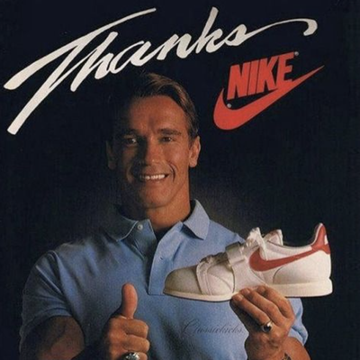

{.post-image}

# What is a model?

When I was a kid, my grandmother lived on the other side of the world, and she would come visit us once every one or two years. Among the many gifts she would bring was a pair of brand new sneakers. In the 1980s, this was a big deal.

The thing about my grandmother was that she was very economical. Yet another big deal in the 1980s. She wasn't cheap, but if she came across a sale on sneakers at any point, she'd buy them then and there. Perhaps a year before her next visit, and certainly not in the weeks leading up to it, like a typical person would.

But how do you buy sneakers for a kid a year in advance?

I have no idea. Maybe she could call some of her friends to see if they had a 5-year-old grandchild and if they wouldn't mind telling her their grandchild's shoe size, gather a few of those, take the average and buy the closest size to that.

That's actually not a bad idea. A bit of a hassle, but not unreasonable.

However, as any parent knows, the size of a kid's sneakers can change rapidly. There's quite a difference between the shoe size of a 5-year-old and the shoe size of a 5-year-8-month-old. What if she didn't have a single friend with a 5y8m-old grandchild?

This is where a pen and a piece of paper come in handy^[Or a Lotus 1-2-3 spreadsheet since we're in the 1980s, and yes my grandmother had one of those.]. My grandmother wrote down the shoe sizes of her friends' grandchildren, and their ages (two numbers per child), and plotted them. Each dot below is one child — x is age, y is shoe size.

```{python}
#| echo: false
#| fig-align: center

import numpy as np
import matplotlib.pyplot as plt

rng = np.random.default_rng(7)

ages_a = rng.integers(1, 11, size=10)
sizes_a = 19 + 1.6 * ages_a + rng.normal(0, 0.7, size=10)

ages_b = rng.integers(1, 11, size=10)
sizes_b = 18 + 1.5 * ages_b + rng.normal(0, 0.7, size=10)

ages = np.concatenate([ages_a, ages_b])
sizes = np.concatenate([sizes_a, sizes_b])

fig, ax = plt.subplots(figsize=(6, 4))
ax.scatter(ages, sizes, color="black")
ax.set_xlabel("Age (years)")
ax.set_ylabel("Shoe size (EU)")
ax.set_xticks(range(1, 11))
plt.show()
```

As can be seen, there is no kid with an age of 5y8m. But a good intuition is to make an educated guess, to fill in the blank, or... to *interpolate*. If we look at the plot above, we can see that the shoe sizes are increasing with age. Specifically, they seem to follow a "hidden" line that my grandmother could easily draw.

```{python}
#| echo: false
#| fig-align: center

slope, intercept = np.polyfit(ages, sizes, 1)
line_x = np.array([1, 10])
line_y = intercept + slope * line_x

fig, ax = plt.subplots(figsize=(6, 4))
ax.scatter(ages, sizes, color="black")
ax.plot(line_x, line_y, color="red", linewidth=3)
ax.set_xlabel("Age (years)")
ax.set_ylabel("Shoe size (EU)")
ax.set_xticks(range(1, 11))
plt.show()
```

From this line, my grandmother could easily estimate the shoe size of a 5y8m-old grandchild. Starting at 5y8m on the x-axis, she could draw a vertical dashed line up to the red line, then a horizontal one across to the y-axis, and read off the resulting y-coordinate.

```{python}
#| echo: false
#| fig-align: center

x_star = 5.67
y_star = intercept + slope * x_star

fig, ax = plt.subplots(figsize=(6, 4))
ax.scatter(ages, sizes, color="black")
ax.plot(line_x, line_y, color="red", linewidth=3)
ax.set_xlabel("Age (years)")
ax.set_ylabel("Shoe size (EU)")
ax.set_xticks(range(1, 11))

ymin, _ = ax.get_ylim()
xmin, _ = ax.get_xlim()
ax.set_ylim(bottom=ymin)
ax.set_xlim(left=xmin)

arrow_style = dict(arrowstyle="->", color="red", linewidth=1.5, linestyle="--")
ax.annotate("", xy=(x_star, y_star), xytext=(x_star, ymin), arrowprops=arrow_style)
ax.annotate("", xy=(xmin, y_star), xytext=(x_star, y_star), arrowprops=arrow_style)

ax.annotate("5y8m", xy=(x_star, ymin), xytext=(3, 3), textcoords="offset points",
            ha="left", va="bottom", color="red", fontsize=8)
ax.annotate("27", xy=(xmin, y_star), xytext=(3, 3), textcoords="offset points",
            ha="left", va="bottom", color="red", fontsize=8)
plt.show()
```

Voila! My grandmother could estimate my shoe size a year in advance to be about 27.

You might claim this is a huge effort for a single shoe size. But notice that red line. My grandmother can now *generalize* to any kid: feed in an age, read off a size. That red line is a model.

Is it a good model? Probably not. For now, let's just say it *fits* the data well.

So what now? Should my grandmother draw these dashed lines for every single kid she might meet? Not really. With little effort, she could deduce the formula for the red line:

$$
\text{shoe size} = 18.5 + 1.5 \times \text{age}
$$

This formula is a model too. It's the same model, but it's written in a different way. It's a bit more abstract, but it's more practical. For any given age, my grandmother can now estimate the shoe size by plugging the age into the formula.

Some would say this form of the model is also more interesting. If we input age 0, we would see that a newborn's shoe size is 18.5^[Real newborns don't actually wear size 18.5, of course. But that's a story for another day.]. That is the line's intercept. And the line's slope of 1.5 means that every year, the shoe size increases by 1.5 sizes.

How did my grandmother get these numbers? Shouldn't she make a separate model for boys and girls? Can she *extrapolate* to my shoe size in 20 years? What if the relationship wasn't a straight line, but a curve? What about all those kids for whom the model is clearly wrong? My grandmother knows me, could she have taken my shoe size when she last saw me into account? All valid questions. For now, let's finish by saying that for us, a model is a relationship between two or more quantities. It can be represented graphically (here, a line) or mathematically (here, the line's equation).