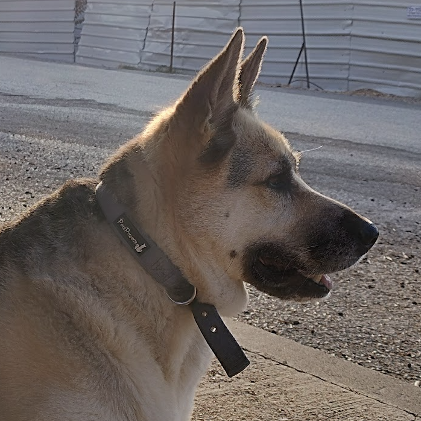
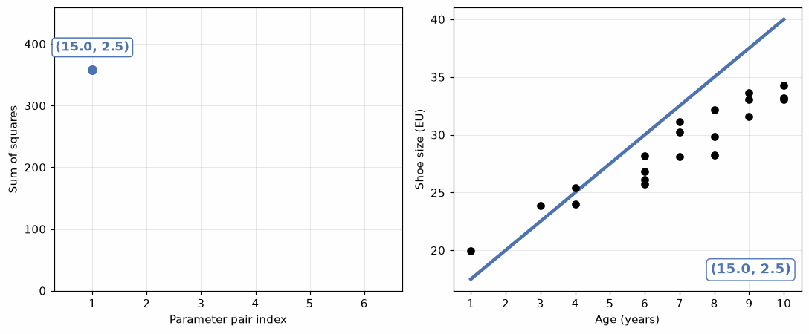

{.post-image}

# Learning, fitting, training.

The dog in the image above is Johann. Johann is over 13 years old, which is quite old for a dog. When we got him from the shelter he was just one, and we had to train him. Well, we tried. We are not an overachieving family. All we wanted him to do was *sit*. Let's pretend we succeeded.

When I stood there, at noon in the park in the summer of 2014, shouting again and again "Johann, sit!", giving him a snack when he did, did I want him to sit at that specific moment after hearing me say "Sit"? Odd question, of course I did. But more than that, I wanted him to do this from now and forever, whenever he hears me say "Sit!". I wanted him to sit in the nighttime as well as daytime. I wanted him to sit if he hears my voice or my daughter's, when we speak loudly or quietly. I wanted him to not just *memorize* that specific circumstance, at noon in the park in the summer of 2014, but *generalize* this behavior to whenever we confidently exclaim "Sit!". This is *training* or *learning* --- the extraction of this single rule from a sequence of observations. Compression, if you will.

And this is exactly what my grandmother did when she trained her shoe-size vs. age model.

$$
\text{shoe size} = 18.5 + 1.5 \times \text{age}
$$

Johann was left with a rule. My grandmother was left with a model. An equation, which we could write even more concisely as the group of numbers the model has: $(18.5, 1.5)$.

In the case of my grandmother's model, the *compression* view of learning is even more appropriate. She started with 20 numbers (20 shoe-sizes), and compressed them to just two numbers, 18.5 and 1.5. From 20 to 2 --- that's 10 times fewer numbers, much more compact than the original data^[There's also a *geometric* version of this argument: in the 2-D plot from the previous post, the fitted line looks like a 1-D "summary axis" through the data, so we could describe each kid by a single number (how far along the line they are) instead of two (age and shoe-size). But this is largely a coincidence of being in two dimensions --- with $p$ predictors a regression hyperplane only shaves one dimension off the data, which isn't much of a compression. The genuinely geometric version of learning-as-compression is *PCA*, which we might meet later.].

These numbers --- 18.5 and 1.5 --- are called the model's *parameters*^[You'd also hear them called *coefficients* or *weights*.]. In this case, they are the *slope* and *intercept* of the line. If this is familiar, you might have heard this in the context of AI or large language models (LLMs), like ChatGPT, which upon its release in 2022 was said to have 175 billion parameters^[I'm guessing that at the time of writing this, it has well over 10 trillion parameters.]. Now *these* parameters may have lost their geometrical meaning, but they are parameters of a model in exactly the same way as 18.5 and 1.5 are parameters of my grandmother's model.

How do we get the parameters that I claim best fit the data? In the case of this simple model which is a straight line (an intercept and a slope) describing the relationship between two quantities, there is a formula. You would put the data in, and the formula would output the parameters^[Look up *simple linear regression* if you're interested in the details.].

For a more general model, we need to define some criterion for "goodness of fit" --- which is low for "bad" parameters and high for "good" parameters --- and make sure it is maximized on our data. Conversely, we can define a "punishment" criterion --- which is high for "bad" parameters and low for "good" parameters --- and make sure it is minimized on our data.

This is called *optimization*. The process of finding the optimal parameters that maximize or minimize a given criterion. To be honest, I don't think you need to fully understand optimization to keep reading this series. So feel free to skip this section. However, there's one additional particularly fascinating aspect in which Johann's training resembles a model's training, that I can only point to if I explain optimization. And that is: *iteration*.

You see, once we define this "punishment" criterion, telling us how bad our model is (or, how badly our parameters fit the data), we can use it to iteratively improve our model. We start with some initial parameters, and then we use the criterion to tell us how bad our model is. We then make small changes to the parameters, and see if the criterion improves. We repeat this process until the criterion is minimized, hence: iteration.

Let's break it down.

We have 20 kids in our data. Each has an (age, real-shoe-size) pair. Mark those as:

$\{(\text{age}_1, \text{real-size}_1), (\text{age}_2, \text{real-size}_2), \dots, (\text{age}_{20}, \text{real-size}_{20})\}$

Suppose we decide the model's parameters are (15, 2.5). That is, the model predicts that a kid's "predicted shoe size" is:

$$
\text{predicted-size} = 15 + 2.5 \times \text{age}
$$

We repeat this 20 times, for each kid, to get the predicted shoe sizes:

$\{\text{predicted-size}_1, \text{predicted-size}_2, \dots, \text{predicted-size}_{20}\}$

We can then calculate the "punishment" for this model on our data. For this type of data, it is customary to use a "punishment" criterion called *sum of squares*:

$$
\text{Sum of squares} = (\text{real-size}_1 - \text{predicted-size}_1)^2 + \dots + (\text{real-size}_{20} - \text{predicted-size}_{20})^2
$$

This is the sum of the squared differences between the real and predicted shoe sizes. The lower the sum of squares, the more similar the real and predicted shoe sizes are, the better the model.

So for parameter values (15, 2.5), the sum of squares is, say: 350.

For our next guess, we try (16, 2.2). The sum of squares is now 200. Clearly, this is a better guess. We can keep trying different parameter values, and see which one gives us the lowest sum of squares.

Below is an animation of this process, over a *carefully chosen* sequence of parameter pairs^[I'm not going to tell you *how* this sequence is chosen just yet.]. On the left, you can see the sum of squares decreasing as we process each parameter pair. On the right, you can see the model's line, gradually fitting the data better and better.

{fig-align="center"}

Now *this* is also learning. In fact, I'd suggest this is what most practitioners of machine learning imagine when they think of "learning". Not the compression or generalization view I described above, but the actual iterative process of minimizing this punishment criterion, or *loss*. But the result is the same.

Circling back to Johann: he wants to get a treat. This is the reward he is trying to maximize. I say "Sit!", he tries a behavior like barking, and sees that he doesn't get the treat. He then tries a different behavior, like rolling on his back, and sees that he gets maybe half a treat. He then repeats this process over and over again, until he learns that "Sit!" means sitting down, which leads to a full delicious treat. So while the model iteratively learns the best parameters to minimize the sum of squares, Johann iteratively learns the best behavior to maximize the reward^[In psychology, this is called *operant conditioning*. It has been claimed that not only can we see Johann's gradual change in behavior, we can actually see his brain changing too, his synapses, their firing rates, etc. You can see how this type of learning involves parameters too.].

And with this general picture of learning, we can now expand out to more complex models.