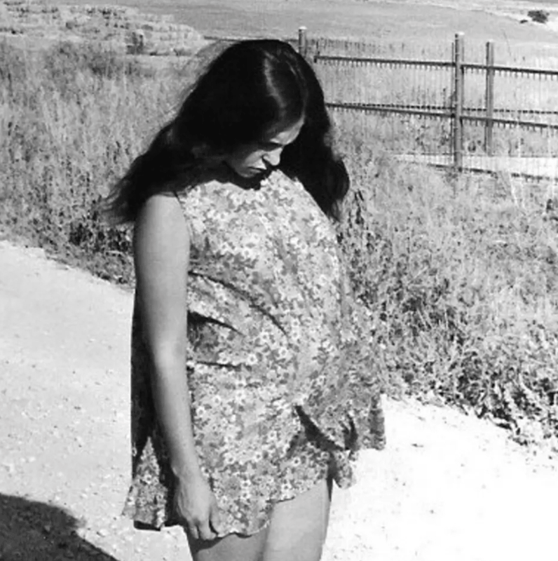

{.post-image}

# Overfitting

My mother gave birth to my brother, her firstborn, when she was 22 years old. My brother was a quiet baby, who slept a lot, ate well and rarely cried. When he was a year old, he could walk. When he was two years old, he could not only speak but also perfectly repeat the songs he had heard on the radio. What's your secret? Nosy neighbors wanted to know. I don't know, my mother would reply, I guess... I guess I'm just an amazing mother. I'd be happy to share some advice.

Then my sister was born, and my mother never gave advice on raising children again.

You see, sample size matters. As a father of three myself, I am suspicious of assertions made by new parents. We are all suspicious of election predictions based on polls of only a few people. And going back to my grandmother's model ---

$$
\text{shoe size} = 18.5 + 1.5 \times \text{age}
$$

--- wouldn't you trust this model more, if I told you it was based on 2000 kids rather than 20?

Speaking of my grandmother, it turns out she kept a record of every kid's sex:

```{python}
#| echo: false
#| fig-align: center

import numpy as np
import matplotlib.pyplot as plt
from matplotlib.lines import Line2D

rng = np.random.default_rng(7)

ages_a = rng.integers(1, 11, size=10)
sizes_a = 19 + 1.6 * ages_a + rng.normal(0, 0.7, size=10)

ages_b = rng.integers(1, 11, size=10)
sizes_b = 18 + 1.5 * ages_b + rng.normal(0, 0.7, size=10)

ages = np.concatenate([ages_a, ages_b])
sizes = np.concatenate([sizes_a, sizes_b])

fig, ax = plt.subplots(figsize=(6, 4))
ax.scatter(ages_a, sizes_a, color="green", marker="o", label="Boys")
ax.scatter(ages_b, sizes_b, color="blue", marker="^", label="Girls")
ax.set_xlabel("Age (years)")
ax.set_ylabel("Shoe size (EU)")
ax.set_xticks(range(1, 11))
ax.legend()
plt.show()
```

It occurred to her that girls' shoe sizes might be on average smaller than boys' shoe sizes. And perhaps two separate lines, or models, would be a better fit to the data. It would probably give a better estimate of my shoe size, taking into account I was a boy.

```{python}
#| echo: false
#| fig-align: center

slope_a, intercept_a = np.polyfit(ages_a, sizes_a, 1)
slope_b, intercept_b = np.polyfit(ages_b, sizes_b, 1)

line_x = np.array([1, 10])
line_y_a = intercept_a + slope_a * line_x
line_y_b = intercept_b + slope_b * line_x

model_legend = [
    Line2D([0], [0], color="green", marker="o", linewidth=2,
           linestyle="--", label="Boys"),
    Line2D([0], [0], color="blue", marker="^", linewidth=2,
           linestyle="-", label="Girls"),
]

fig, ax = plt.subplots(figsize=(6, 4))
ax.scatter(ages_a, sizes_a, color="green", marker="o")
ax.scatter(ages_b, sizes_b, color="blue", marker="^")
ax.plot(line_x, line_y_a, color="green", linewidth=2, linestyle="--")
ax.plot(line_x, line_y_b, color="blue", linewidth=2, linestyle="-")
ax.set_xlabel("Age (years)")
ax.set_ylabel("Shoe size (EU)")
ax.set_xticks(range(1, 11))
ax.legend(handles=model_legend)
plt.show()
```

This meant she was now looking to estimate not 2, but 4 parameters: the intercept and slope for boys, and the intercept and slope for girls.

She repeated the model-fitting process we [discussed](03_learning.qmd) in the previous chapter, using sum of squares as the loss to minimize, and reached:

$$
\text{shoe size} =
\begin{cases}
19 + 1.6 \times \text{age} & \text{for boys} \\
18 + 1.5 \times \text{age} & \text{for girls}
\end{cases}
$$

Remember, my grandmother used the same 20 kids. Previously she had used them to estimate 2 parameters; now she was estimating 4. Granted, going from a compression of 20 to 2 to a compression of 20 to 4 is a bit disappointing, but *looking at the data*, it seems like a reasonable model. Moreover, if you look at the sum of squares, it's actually *a lot* lower than the sum of squares of the straight line model: from 27.6 to 5.9, an 80% decrease! So it sounds like a good trade-off.

Trade-off of what?

Let's take this to the extreme. Look again and tell me if a straight line is *the* best fit to the data. After all, some of the real data points are not on a straight line, so why not use a curve? Why not:

$$
\text{shoe size} =
\begin{cases}
\text{intercept}_a + \text{slope}_a \times \text{age} + \text{curvature}_a \times \text{age}^2 & \text{for boys} \\
\text{intercept}_b + \text{slope}_b \times \text{age} + \text{curvature}_b \times \text{age}^2 & \text{for girls}
\end{cases}
$$

The resulting model:

```{python}
#| echo: false
#| fig-align: center

coef_a = np.polyfit(ages_a, sizes_a, 2)
coef_b = np.polyfit(ages_b, sizes_b, 2)

curve_x = np.linspace(1, 10, 100)
curve_y_a = np.polyval(coef_a, curve_x)
curve_y_b = np.polyval(coef_b, curve_x)

fig, ax = plt.subplots(figsize=(6, 4))
ax.scatter(ages_a, sizes_a, color="green", marker="o")
ax.scatter(ages_b, sizes_b, color="blue", marker="^")
ax.plot(curve_x, curve_y_a, color="green", linewidth=2, linestyle="--")
ax.plot(curve_x, curve_y_b, color="blue", linewidth=2, linestyle="-")
ax.set_xlabel("Age (years)")
ax.set_ylabel("Shoe size (EU)")
ax.set_xticks(range(1, 11))
ax.legend(handles=model_legend)
plt.show()
```

Looks better, maybe? The sum of squares is now 3.9!

Why not add $\text{age}^3$, $\text{age}^4$ and $\text{age}^5$ then?

```{python}
#| echo: false
#| fig-align: center

coef_a = np.polyfit(ages_a, sizes_a, 5)
coef_b = np.polyfit(ages_b, sizes_b, 5)

curve_x = np.linspace(1, 10, 100)
curve_y_a = np.polyval(coef_a, curve_x)
curve_y_b = np.polyval(coef_b, curve_x)

fig, ax = plt.subplots(figsize=(6, 4))
ax.scatter(ages_a, sizes_a, color="green", marker="o")
ax.scatter(ages_b, sizes_b, color="blue", marker="^")
ax.plot(curve_x, curve_y_a, color="green", linewidth=2, linestyle="--")
ax.plot(curve_x, curve_y_b, color="blue", linewidth=2, linestyle="-")
ax.set_xlabel("Age (years)")
ax.set_ylabel("Shoe size (EU)")
ax.set_xticks(range(1, 11))
ax.set_ylim(19, 35)
ax.legend(handles=model_legend)
plt.show()
```

The sum of squares is now 2.9!

But wait, this looks ridiculous. For girls, it looks like before the age of 5 there is a sharp drop from some shoe size so large it doesn't fit in the plot, and only then it starts to increase. It looks like the model is trying to fit the data too closely. It looks forced. Desperate. Overkill. *Overfitting*.

A model is prone to overfitting when it is too complex for the data. When for a given number of observations, it tries to estimate too many parameters. In that last example, we used 20 observations to fit a model with 12 parameters (count!). Might as well memorize the data. Which is what every machine learning practitioner dreads, especially those working on large language models like ChatGPT, which could have memorized the entire Wikipedia with its huge capacity. Because memorizing isn't learning. The chances of the model generalizing well to new data are slim. This was made clear above where the model predicted a shoe size of --- check notes --- 40, for a 4-year-old girl.

So a trade-off of what?

The trade-off between the model's complexity and its ability to generalize to new data. In the above example, the model was so complex it was able to fit the data almost perfectly, but it was not able to generalize to new data. And the root of this phenomenon called overfitting is trying to fit as many parameters as possible, regardless of whether they are necessary or not. There's only so much you can learn with 20 observations. And with only 1 observation you can't learn anything, Mom.

How do we know when a model is overfitting? Who can say if the additional parameters are necessary or not?

The famous statistician [George Box](https://en.wikipedia.org/wiki/George_E._P._Box) said: "All models are wrong, but some are useful." To me this says we should assume the model is wrong, that there is some error, noise, or *variability* in the data that we are not accounting for, and cannot account for, with our given budget of observations. If we strive for the most complex model possible, it will start "eating" from that variability, fitting the noise, instead of learning an underlying general pattern. And we should use a simpler model that is easier to understand and interpret. One that our limited data can afford to learn.

Once you internalize this, you will check yourself. Of course there are formal (and less formal) methods to test for overfitting, but nothing beats looking at the data and asking yourself whether these parameters are "worth it". Above we quantified this: adding just two parameters to the model (to separate boys and girls) reduced the sum of squares by 80%. That seems like a good trade-off. From that point, the return on adding more parameters started to diminish, despite the fact that the sum of squares kept going down. With added parameters, it can only go down. Wikipedia can be memorized. This won't help ChatGPT think of a new chicken parmesan recipe.

If you are rich in data, you can always split it into training and testing datasets. You'd fit the model on the training dataset and test it on the testing dataset. Does the model generalize to unseen data? Good. Try a more complex model. Does the model's performance deteriorate? Well you better stop there.