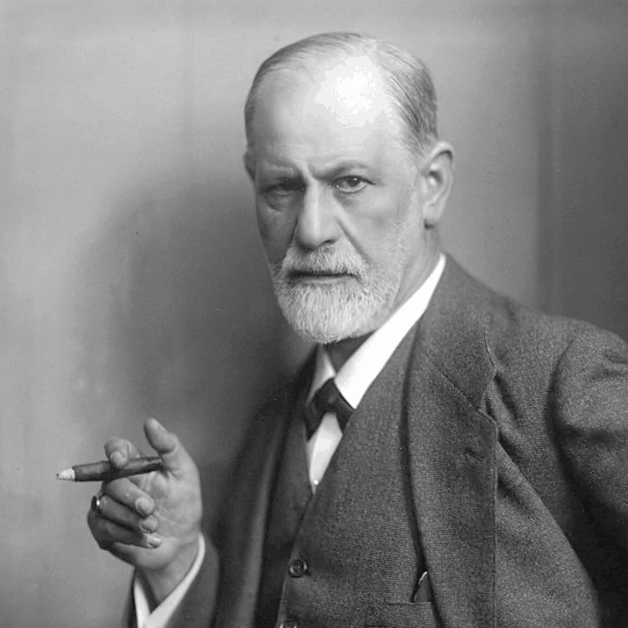

{.post-image}

# Random variables in a model?

I have a BA in psychology. I'm not entirely sure why, and it's been 20 years since I graduated. Anyway, one of the few memories that stuck with me is sitting in a class and hearing that Sigmund Freud theorized that by around age four, the basic structure of personality has already been established. My friends and I laughed. How ridiculous.

It wasn't until I had kids of my own that I realized --- and I'm sorry if this offends some positive-psychology-people-can-change devotees out there --- Sigmund was spot on. If anything, he could have gone even further. I knew exactly who each of my kids was by the time they were one month old.

Am I claiming one's entire life is determined at age four? No. But it sure helps to know one's shoe size at age four to determine their shoe size at age five years and eight months!

That is why I'm a bit embarrassed to tell you of another small detail I forgot to mention about my grandmother's data of 20 kids' shoe sizes. You see, there weren't really 20 kids, it was more like 10 kids, each with 1-4 shoe sizes at different ages. And, one of those kids was me, at age four.

If we put the data in a table, where each row is a kid and each column is an age, it looks like this:


| Kid | 1 | 2 | 3 | 4 | 5 | 6 | 7 | 8 | 9 | 10 |
|-----|---|---|---|---|---|---|---|---|---|----|
| Kid 1 | --- | --- | --- | 25.4 | --- | --- | --- | --- | --- | --- |
| Kid 2 | 19.9 | --- | 23.9 | --- | --- | --- | --- | --- | --- | --- |
| Kid 3 | --- | --- | --- | --- | --- | --- | 31.1 | 32.1 | 33.1 | --- |
| Kid 4 | --- | --- | --- | --- | --- | --- | --- | --- | 33.6 | 34.3 |
| Kid 5 | --- | --- | --- | --- | --- | 28.2 | 30.2 | --- | --- | --- |
| Kid 6 | --- | --- | --- | --- | --- | 26.8 | 28.1 | 29.9 | 31.6 | --- |
| Kid 7 | --- | --- | --- | 24.0 | --- | 25.7 | --- | --- | --- | --- |
| Kid 8 | --- | --- | --- | --- | --- | --- | --- | 28.2 | --- | 33.1 |
| Kid 9 | --- | --- | --- | --- | --- | 26.1 | --- | --- | --- | --- |
| Kid 10 | --- | --- | --- | --- | --- | --- | --- | --- | --- | 33.2 |


Or to put this in a plot:

```{python}
#| echo: false
#| fig-align: center

import numpy as np
import matplotlib.pyplot as plt

rng = np.random.default_rng(7)

ages_a = rng.integers(1, 11, size=10)
sizes_a = 19 + 1.6 * ages_a + rng.normal(0, 0.7, size=10)

ages_b = rng.integers(1, 11, size=10)
sizes_b = 18 + 1.5 * ages_b + rng.normal(0, 0.7, size=10)

# the same 20 observations, now grouped into 10 kids
kids_a = [[9], [8, 7], [2, 3, 5], [0, 6], [1, 4]]
kids_b = [[1, 4, 5, 7], [0, 8], [6, 9], [2], [3]]

groups = ([(idx, "o", ages_a, sizes_a) for idx in kids_a] +
          [(idx, "^", ages_b, sizes_b) for idx in kids_b])

colors = plt.get_cmap("tab10").colors

fig, ax = plt.subplots(figsize=(7.5, 4))

for kid, (idx, marker, ages, sizes) in enumerate(groups, start=1):
    age = ages[idx]
    size = sizes[idx]
    order = np.argsort(age)
    ax.plot(age[order], size[order], marker=marker, color=colors[kid - 1],
            markeredgecolor="white", markeredgewidth=0.6, label=f"Kid {kid}")

ax.set_xlabel("Age (years)")
ax.set_ylabel("Shoe size (EU)")
ax.set_xticks(range(1, 11))
ax.legend(loc="upper left", bbox_to_anchor=(1.02, 1), frameon=False)
fig.tight_layout()
plt.show()
```

In the above plot, the shoe sizes of each kid are connected by a line, with a different color for each kid. I'm Kid 1, with my single observation at age four, that blue dot. The reason I don't have a line is that I only have one observation.

Now this is a completely different dataset. We no longer have a bunch of unrelated $(\text{age}, \text{shoe size})$ observations from which to fit a single, global model to determine a kid's shoe size from their age. Instead, we have a sequence of a few shoe sizes from each kid at different ages, forming what is sometimes called a set of short *time series*, or a *longitudinal* dataset^[Named this way because the observations are taken over time, perhaps a very long time.]. This dataset, by the way, is very common in the social and physical sciences, where we follow a few individuals with repeated measurements over time. And it seems appropriate to account for this "grouped" structure of our data when modeling it. It seems reasonable to expect that a model incorporating the fact that some observations belong to Kid 3 who has relatively large shoe sizes, and some belong to Kid 7 who has relatively small shoe sizes, will better predict the shoe size of a new kid than a model that ignores this structure. Let alone for a kid who is *in* the dataset! The only question is: how to incorporate this new data structure.

A blessing and a curse.

You could argue, there's no real difference from our previous change in the model, where I revealed that half of the kids are boys and half are girls. In that case, we saw fit to train two separate models or lines, one for each category: $\text{model}_{\text{boys}}$ and $\text{model}_{\text{girls}}$. Now we have ten categories, why not fit ten separate models, one for each kid?

$$ \text{model}_{\text{kid}_1}: \text{shoe size}_{\text{kid}_1} = \text{intercept}_{\text{kid}_1} + \text{slope}_{\text{kid}_1} \times \text{age} $$
$$ \text{model}_{\text{kid}_2}: \text{shoe size}_{\text{kid}_2} = \text{intercept}_{\text{kid}_2} + \text{slope}_{\text{kid}_2} \times \text{age} $$
$$ \text{model}_{\text{kid}_3}: \text{shoe size}_{\text{kid}_3} = \text{intercept}_{\text{kid}_3} + \text{slope}_{\text{kid}_3} \times \text{age} $$
$$\vdots$$

$$ \text{model}_{\text{kid}_{10}}: \text{shoe size}_{\text{kid}_{10}} = \text{intercept}_{\text{kid}_{10}} + \text{slope}_{\text{kid}_{10}} \times \text{age} $$

Then, for each of the 10 kids in the dataset, including me, we could predict their shoe size from any age, using the appropriate model: $\text{shoe size}_{\text{kid}_1}$ for Kid 1, $\text{shoe size}_{\text{kid}_2}$ for Kid 2, etc.

But what would we do with an "unseen" kid, who is not in the dataset?

Plan B: train one "global" default model that would predict the shoe size of any kid from any age, and 10 additional "personal" models, one for each kid in the dataset, having their parameters reflect the *difference* from the global model^[For reasons we're not going into here, if were to pursue this model, we would need to constrain the intercept-diffs to sum to 0, and the slope-diffs to sum to 0. I just don't think it's worth the effort at this particular point in the story.]. We will call these, for short, $\text{i-diff}$ and $\text{s-diff}$ for intercept-diff and slope-diff, respectively.

$$ \text{model}_{\text{global}}: \text{shoe size}_{\text{global}} = \text{intercept}_{\text{global}} + \text{slope}_{\text{global}} \times \text{age} $$
$$ \text{model}_{\text{kid}_1}: \text{shoe size}_{\text{kid}_1} = (\text{intercept}_{\text{global}} + \text{i-diff}_{\text{kid}_1}) + (\text{slope}_{\text{global}} + \text{s-diff}_{\text{kid}_1}) \times \text{age} $$
$$ \text{model}_{\text{kid}_2}: \text{shoe size}_{\text{kid}_2} = (\text{intercept}_{\text{global}} + \text{i-diff}_{\text{kid}_2}) + (\text{slope}_{\text{global}} + \text{s-diff}_{\text{kid}_2}) \times \text{age} $$
$$\vdots$$

$$ \text{model}_{\text{kid}_{10}}: \text{shoe size}_{\text{kid}_{10}} = (\text{intercept}_{\text{global}} + \text{i-diff}_{\text{kid}_{10}}) + (\text{slope}_{\text{global}} + \text{s-diff}_{\text{kid}_{10}}) \times \text{age} $$

That way, if you are one of the 10 kids in the dataset, say you're Kid 2, your intercept is $\text{intercept}_{\text{global}} + \text{i-diff}_{\text{kid}_2}$ and your slope is $\text{slope}_{\text{global}} + \text{s-diff}_{\text{kid}_2}$. Any of these $\text{diff}$'s, by the way, can be negative. And if you are not in the dataset, say you're Kid 11, your slope is $\text{slope}_{\text{global}}$ and your intercept is $\text{intercept}_{\text{global}}$. The model would know nothing personalized to you, but it would know a general trend that is shared by all kids. That would be its best guess for you.

Why is this a blessing?

This is Freud, only for shoe sizes. You're you and I am me, from a very young age. Kid 3 obviously has a different starting point than Kid 7, as well as a different change rate. And a model that can capture this would be a better predictor of shoe size for Kid 3 --- or any other kid! --- than a model that does not. I trust $\text{intercept}_{\text{global}}$ and $\text{slope}_{\text{global}}$ *more*, now that I know they have been "cleaned" from personal differences, from that really tall Kid 3, and that really short Kid 7.

Why is this a curse then?

Well, it might not be. If we had many observations for each kid, the model above would be a good solution. Suppose we were measuring heart rate from many individuals' smartwatches every minute for years. These types of datasets exist. But this is not the case here, and it rarely is.

First of all, there are some kids with only one observation, like me. Can you fit a line to a single point? That means their intercept-diff and slope-diff parameters are not estimable. Second, and more importantly, how many parameters are we talking about here? 10 intercept-diffs and 10 slope-diffs, plus the global intercept and slope. That's 22 parameters. And we only have 20 observations! That's a lot of parameters for not a lot of data. 

What's the word I'm looking for? Oh yes, **overfitting**.

Really?! A pair of parameters for Kid 3? And a pair of parameters for Kid 7? And another pair for Kid 4? From just 2-3 observations each?! This model will surely overfit the data. It will memorize it almost perfectly. If there's some measurement error, or a typo from my grandmother, the model will fit *that* as well.

So, good idea, bad execution.

Here's a different idea. What if each kid's intercept-diff and slope-diff are not parameters, but instances of random variables --- samples! --- and not just any random variables, but normal random variables, with a mean of 0 and some variance we need to learn: $\mathcal{N}(0, \text{var}_{\text{intercept}})$ and $\mathcal{N}(0, \text{var}_{\text{slope}})$. For example, these distributions could look like this:

```{python}
#| echo: false
#| fig-align: center

import numpy as np
import matplotlib.pyplot as plt
from scipy.stats import norm

colors = plt.get_cmap("tab10").colors

x = np.linspace(-10, 10, 1001)
sigma_i = 3.0
sigma_s = 1.2

fig, ax = plt.subplots(figsize=(7.5, 4))

ax.plot(x, norm.pdf(x, 0, sigma_i), color=colors[0])
ax.plot(x, norm.pdf(x, 0, sigma_s), color=colors[1])

ax.annotate(r"$\mathcal{N}(0, \mathrm{var}_{\text{intercept}})$",
            xy=(4.5, norm.pdf(4.5, 0, sigma_i)), xytext=(6.5, 0.16),
            color=colors[0], ha="left", va="center",
            arrowprops=dict(arrowstyle="->", color=colors[0]))

ax.annotate(r"$\mathcal{N}(0, \mathrm{var}_{\text{slope}})$",
            xy=(-1.4, norm.pdf(-1.4, 0, sigma_s)), xytext=(-8.5, 0.3),
            color=colors[1], ha="left", va="center",
            arrowprops=dict(arrowstyle="->", color=colors[1]))

ax.set_xlabel("x")
ax.set_ylabel("f(x)")
ax.set_ylim(0, 0.4)
fig.tight_layout()
plt.show()
```

And Kid 1 sampled an $\text{i-diff}_{\text{kid}_1}$ of +2.5, and a $\text{s-diff}_{\text{kid}_1}$ of +0.5. Kid 2 sampled an $\text{i-diff}_{\text{kid}_2}$ of -1.0, and a $\text{s-diff}_{\text{kid}_2}$ of +0.2. And so on.

Let's not worry for a moment how we would evaluate these random-variable samples, $\text{i-diff}_{\text{kid}_1}$, $\text{s-diff}_{\text{kid}_1}$, $\text{i-diff}_{\text{kid}_2}$, $\text{s-diff}_{\text{kid}_2}$, etc., and just imagine we have some way to get their values.

What would we gain from this?

A lot. For one, we would have only two additional parameters to learn --- instead of 20! --- the variances of the random variables' normal distributions. All intercept-diffs will *share* a single parameter, and all slope-diffs will *share* a single parameter. Much less chance of overfitting. In addition, we will later show how treating each kid's intercept-diff and slope-diff as a random variable sample makes them *shrink* towards 0, making each kid's intercept and slope closer to the global model's intercept and slope, and the fewer observations a kid has, the higher the shrinkage. Why is that a good thing? That overfitting again, you want to take a kid's intercept and slope with a grain of salt if they are based on fewer observations. Moreover, those $\text{var}_{\text{intercept}}$ and $\text{var}_{\text{slope}}$ parameters --- for some researchers, they could mean a lot, or even everything.^[For now, ask yourself: what does it mean if they are very very small, close to zero? Very large?] Lastly, we have just crossed the border towards --- brace yourselves, trust me, it won't hurt --- probabilistic models. Models based on random variables. Models based on probability. These tend to be more robust and more interpretable.

So, a model with both *fixed* parameters and *random* variables samples? That's crazy. I bet you're dying to know how it works. Soon. Very soon. But first, a short history lesson.