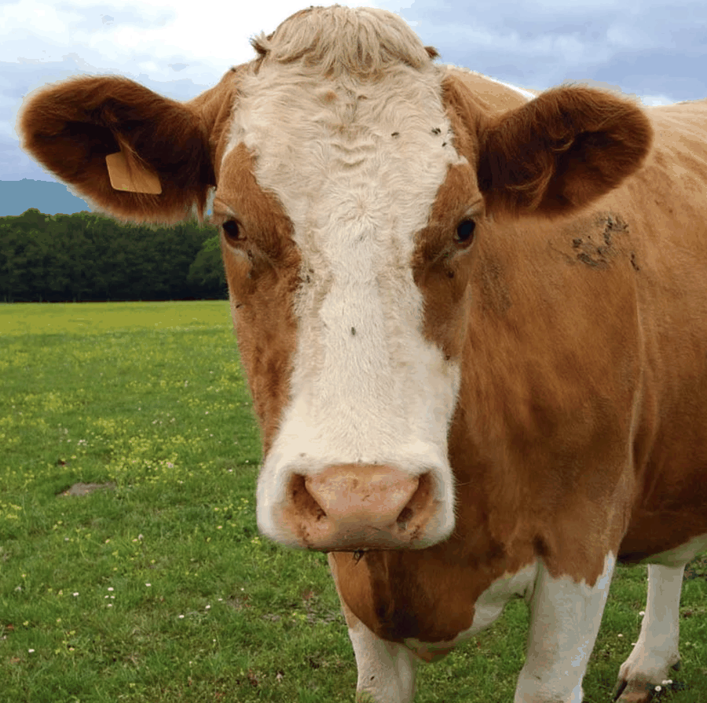
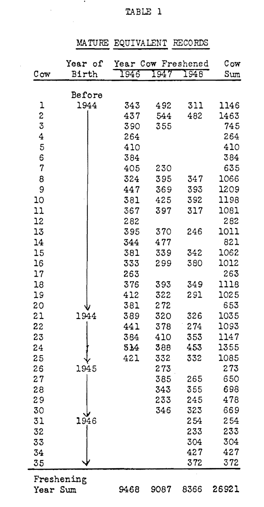

{.post-image}

# A history lesson

When I was working on my MSc, my favorite way of making a living was to teach statistics to undergraduate students. A teaching assistant. And boy, did I have my hands full! Because everyone has to learn statistics. I taught at the Electrical Engineering department, Physics, Computer Science, Medicine, Economics, Sociology, Political Science. Made a ton of money off the Psychology department. And even at the Social Work department^[Why do social workers need statistics? I was asked that weekly, never had a good answer.].

This is fitting, because statistics did not originate as an autonomous discipline. Statistics is almost inherently interdisciplinary. It emerged from scientists trying to solve problems involving data. The greatest statisticians of the past weren't statisticians. [Ronald Fisher](https://en.wikipedia.org/wiki/Ronald_Fisher) was a biologist. [Frank Wilcoxon](https://en.wikipedia.org/wiki/Frank_Wilcoxon) was a chemist. [Charles Spearman](https://en.wikipedia.org/wiki/Charles_Spearman) was a psychologist. [Karl Pearson](https://en.wikipedia.org/wiki/Karl_Pearson), who founded the first university statistics department in 1911, was a mathematician.

One of those greats was [Charles Roy Henderson](https://en.wikipedia.org/wiki/Charles_Roy_Henderson). And he was very much interested in... cows. Or more specifically, dairy cattle: their heredity, their milk production, and breeding programs to maximize it. Henderson worked at the department of Animal Science at Cornell University, previously known as the department of Animal Husbandry. The following is an actual data table from his 1949 paper "Estimation of changes in herd environment" from the Journal of Dairy Science^[Which exists to this day!]:

{fig-align="center" width=50%}

Here, every cow is a row, and every column is the year in which it was "freshened", meaning, basically, that it calved and started a lactation. The number in each cell is the volume of milk produced by that cow in that year. There are 35 cows, and each was measured between 1 and 3 times.

Does this data look familiar? It should! It's very similar to the data my grandmother collected on kids' shoe sizes. Think of it like this: each cow is a kid, each year of milk production is a kid's age, and a measured milk volume is a kid's shoe size.^[Even that extra variable of the cows' year of birth (Henderson divided this into four categories) is similar to our extra variable of the kids' sex, which we only briefly mentioned.]

What was Henderson doing? He was trying to estimate a few things:

a. The effect of change in "environment" on milk production, which he defined as the change in year (similar to our change rate in age, the slope of the line).
b. The "personal" diffs, or effects, of each cow. Actually, not the effects per se, but their ranking. Henderson was interested in breeding, he wanted to pinpoint the "best" cows to breed from, in order to maximize milk production.
c. The extent to which a cow's milk production is dependent on its genetic inheritance, versus the environment.

Henderson's model was also very similar to ours, brought here in a simplified form:

$$
\text{model}_{\text{year}_i, \text{cow}_j} = \text{population mean} + \text{year effect}_i + \text{cow effect}_j + \text{error}_{\text{year}_i, \text{cow}_j}
$$

That is, the milk production of a cow $j$ in a given year $i$ is the population mean, plus the effect of year $i$, plus the effect of the cow $j$, plus an error term. The population mean and the year effects are parameters, they are fixed. The cow effects are samples of a normally distributed random variable, $\mathcal{N}(0, \text{var}_{\text{cow}})$, and the error term is a sample of a normally distributed random variable, $\mathcal{N}(0, \text{var}_{\text{error}})$. Most importantly, how many parameters did Henderson have to estimate? The population mean, the three year effects, and the two variances of the cow effects and the error term^[This isn't accurate. In order for this to work, we would need to either set one of the year effects to 0, or constrain the year effects to sum to 0. But I think you get the idea.]. Doable.

Most of Henderson's paper deals with how to estimate these parameters, how to get those cow effects, and how to evaluate to what extent milk production is hereditary. We haven't talked about any of this. So why do we need this history lesson?

Because I want you to know the reach this model has. The applicability of this way of thinking, which is not limited to kids' shoe sizes or cows' milk production, but extends to numerous scenarios in all kinds of fields, with more variables, other kinds of relationships, other distributions, and to modern-day big data for predictive modeling with machine learning.

Before we go, let's give some more examples of situations where this model is applicable.

1. A scientist wants to compare four fertilizers to determine which produces the largest crop yield. The experiment is carried out on many different plots of land. Each plot receives one fertilizer, and the yield is measured several times during the growing season.

2. A researcher wants to compare three diets in terms of their effect on body weight. Many people are randomly selected and assigned to one of the three diets. Their weight is measured at several points during the study.

3. An engineer wants to compare the performance of three different machine settings. The experiment is repeated on many machines, with each machine tested under the different settings, and each group of machines is operated by a different operator.

4. A geographer wants to compare the average level of a pollutant in four different types of land use: residential, industrial, agricultural, and parkland. Measurements are taken at many randomly selected locations within the different land-use areas. Each location is sampled several times throughout the year, and it is well known that nearby locations are correlated.

5. An online retailer wants to predict how much a customer will spend on their next visit using information about the visit, the products viewed, time of day, promotions, and so on. The dataset contains millions of customers, some of whom appear only once or twice, while a smaller number appear many times. The data further contains information about the customer's demographics, their neighborhood, their income, and so on.

Do you see a pattern?