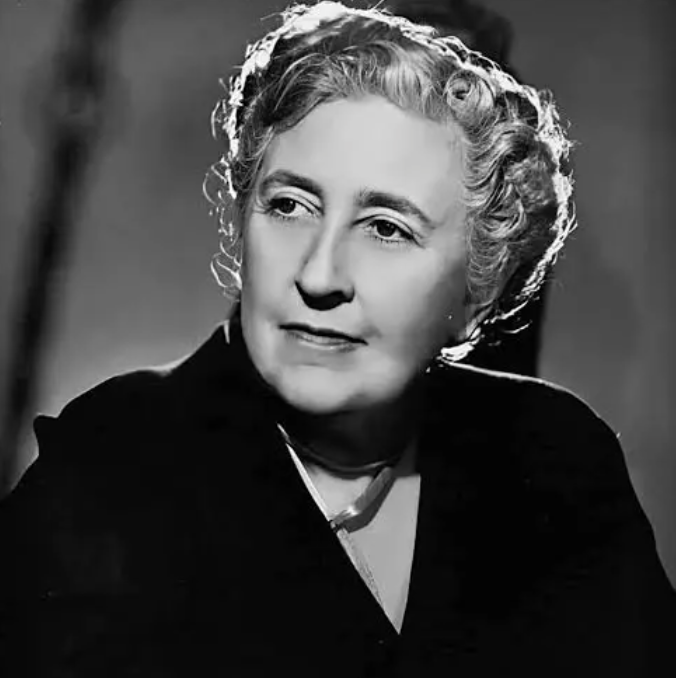

{.post-image}

# Likelihood

Have you ever wondered how a crime novelist writes a story?

It is well known that Agatha Christie, for the most part, started with the crime. She would have the murder --- or rather the mechanism or literary trick she wanted to use --- written down, before she started writing the story, obscuring the details, making it difficult for the detective and her readers to decipher the crime.

But there are other ways to write a crime novel.

A lesser-known American crime novelist, [Martha Grimes](https://en.wikipedia.org/wiki/Martha_Grimes), started with the evidence. She would have the body of the victim found, and from there she would build the story, discovering the culprit, the way the victim was killed and the motive, as she went along.

If you had to write a murder mystery, would you start with the crime or with the evidence? Are you an Agatha or a Martha?

In statistics, we're often both.

Previously, I asked you to assume the probability of having a girl ($P(\text{girl})$) was $\frac{1}{2}$, and we were interested in $G$ --- the random variable counting the number of girls in a family of 3 children. We were able to write the full distribution of $G$, in a table, or in a plot, by simple computation:

```{python}
#| echo: false
#| fig-align: center

import matplotlib.pyplot as plt
import numpy as np

# Define the random variable
G = np.array([0, 1, 2, 3])

# Define the probability distribution
P = np.array([1/8, 3/8, 3/8, 1/8])

# Plot the probability distribution
plt.bar(G, P)
plt.xlabel('G')
plt.ylabel('P(G)')
plt.xticks(G)
plt.ylim(0, 0.4)
plt.show()
```

What if I asked you to *sample* or *generate* data from this distribution? Sample 3 kids, call them one family, count the number of girls, say it is 2. Sample another group of 3 kids, call them another family, count the number of girls, say it is 1. And so on, for many (fake!) families, say a billion, and we would get a long sequence of numbers of girls in a 3-children family: $\{2, 1, 2, 0, 3, ...\}$. If we were to plot the frequency of each result in a simple bar chart --- the proportion, or frequency, of families that have 0, 1, 2 or 3 girls --- what would it look like? It would look exactly like our distribution of $G$, with a small change to the label on the y-axis:

```{python}
#| echo: false
#| fig-align: center

import matplotlib.pyplot as plt
import numpy as np

# Define the random variable
G = np.array([0, 1, 2, 3])

# Define the probability distribution
P = np.array([1/8, 3/8, 3/8, 1/8])

# Plot the probability distribution
plt.bar(G, P)
plt.xlabel('G')
plt.ylabel('Frequency')
plt.xticks(G)
plt.ylim(0, 0.4)
plt.show()
```

It would look exactly like our distribution of $G$ because this is exactly the meaning of probability. Probability is the long-run frequency of an event.^[Some mathematicians would disagree --- I'll live with that.]

Here, we're being an Agatha. We start with the parameters of the distribution, the crime, and we generate data from it, the story, or the evidence:

$$
\text{Parameters} \rightarrow \text{Data}
$$

However, most of the time in statistics, we work in the opposite direction. We start with the data, the body of the victim, and we try to estimate the parameters behind it, the crime. We're being a Martha.

$$
\text{Data} \rightarrow \text{Parameters}
$$


The process often goes like this: Sample a finite number of (real!) 3-children families, count the number of girls in each family ($G$), and draw the frequency of each result. The *empirical* distribution. Since you have a limited budget, you usually have a lot less than a billion families, say 100. Suppose you get 2 girls in one family, 1 girl in another family, and so on. You might write down the data like this: $\{G_1 = 2, G_2 = 1, \dots, G_{100} = 0\}$. The empirical distribution might look like this:

```{python}
#| echo: false
#| fig-align: center

import matplotlib.pyplot as plt
import numpy as np

G = np.array([0, 1, 2, 3])

P = np.array([0.16, 0.3, 0.4, 0.14])

plt.bar(G, P)
plt.xlabel('G')
plt.ylabel('Frequency')
plt.xticks(G)
plt.ylim(0, 0.4)
plt.show()
```

Imperfect. Noisy. As bodies of victims often are. But you have it. And now you want to estimate the parameters of the distribution that generated it, $P(\text{girl})$.

But how do you do that?

First, in this specific case, let's use our intuition. These are just two outcomes, $\{\text{girl}, \text{boy}\}$. I'd say most people would agree that the estimator of $P(\text{girl})$ is the proportion of girls in the sample:

$$
\hat{P}(\text{girl}) = \frac{\text{number of girls in the sample}}{\text{total number of children in the sample}}
$$

--- and they'd be right. But we want to be more general.

So, let's draw a few possible *empirical* distributions of $G$, what *could* have happened in three hypothetical worlds, with different values of true $P(\text{girl})$?

```{python}
#| echo: false
#| fig-align: center
#| out-width: 100%

import matplotlib.pyplot as plt
import numpy as np

G = np.array([0, 1, 2, 3])

samples = [
    np.array([0.60, 0.33, 0.06, 0.01]),
    np.array([0.16, 0.3, 0.4, 0.14]),
    np.array([0.01, 0.06, 0.33, 0.60]),
]

fig, axes = plt.subplots(1, 3, figsize=(7.5, 2.8))

for ax, P in zip(axes, samples):
    ax.bar(G, P)
    ax.set_xlabel('G')
    ax.set_xticks(G)
    ax.set_ylim(0, 0.7)

axes[0].set_ylabel('Frequency')

fig.tight_layout()
plt.show()
```

Now I ask you to estimate $P(\text{girl})$ for each of these three worlds. Wouldn't you agree that $P(\text{girl})$ in the leftmost world must be quite low, the $P(\text{girl})$ in the rightmost world must be quite high, and the $P(\text{girl})$ in the middle world must be somewhere in between?

How did you do it?

You searched for the value of $P(\text{girl})$ that makes the empirical distribution most *likely* to have happened. Like a good detective, you canvassed the options in front of you, and you found the one that best fits the evidence.

"Canvassing the options and finding the most likely one"... this sure sounds familiar. Isn't this a lot like... [Learning](./03_learning.qmd)?

Why yes, it is. There we tried to find the best pair of intercept and slope parameters of a straight line that best fits the kids' shoe sizes data. We did this by *minimizing* a punishment criterion, a loss function, the sum of squared errors.

Here, we're trying to find the best value of $P(\text{girl})$ by *maximizing* a reward criterion, a *likelihood* function.

This likelihood is the probability of the data. How likely is the data we observed, given a particular value of $P(\text{girl})$? We observed 100 3-children families, and measured $G$ in each of them: $\{G_1 = 2, G_2 = 1, \dots\, G_{100} = 0\}$. And assuming these families are independent, the likelihood is the product of the probabilities of these $G$'s --- the product of 100 probabilities of number of girls in 3-children families that we observed. Let's write it out:

$$
\begin{align}
Likelihood &= P(\text{the data we observed}) \\
&= P(\text{2 girls in family 1}, \text{1 girl in family 2}, \dots, \text{0 girls in family 100}) \\
&= P(G_1 = 2, G_2 = 1, \dots, G_{100} = 0) \\
&= P(G_1 = 2) \times P(G_2 = 1) \times \cdots \times P(G_{100} = 0) \\
\end{align}
$$

We already [calculated](./05_random_variable.qmd) each of these probabilities. The difference is that now $P(\text{girl})$ is unknown. Each one of these probabilities depends on $P(\text{girl})$, so the likelihood is a function of $P(\text{girl})$. You can simplify it a bit to get a nice compact expression, but that's not necessary for our purposes. Notice also that this is a very small number, because you are multiplying a lot of fractions, no matter what value you plug in for $P(\text{girl})$. How do you maximize it?

Previously, we had a pair of parameters, so I animated the process for a carefully chosen sequence of values of the parameters, showing how the sum of squared errors decreased as we moved along the parameter space. Here, we have a single parameter, so we can just calculate and plot this likelihood function for a range of values of $P(\text{girl})$, from 0 to 1.

```{python}
#| echo: false
#| fig-align: center

import matplotlib.pyplot as plt
import numpy as np
from scipy.stats import binom

G = np.array([0, 1, 2, 3])
freq = np.array([0.16, 0.3, 0.4, 0.14])
counts = np.round(freq * 100).astype(int)

p = np.linspace(0.001, 0.999, 1000)
logL = np.zeros_like(p)
for k, n_k in zip(G, counts):
    logL += n_k * binom.logpmf(k, 3, p)
L = np.exp(logL - logL.max())

mle = np.sum(G * counts) / (3 * counts.sum())

plt.plot(p, L)
plt.axvline(mle, color="red")
plt.annotate(f"MLE = {mle:.2f}", xy=(mle, 0.0), xytext=(mle + 0.08, 0.15),
             color="red", arrowprops=dict(arrowstyle="->", color="red"))
plt.xlabel(r"$P(\mathrm{girl})$")
plt.ylabel("Likelihood (peak scaled to 1)")
plt.xlim(0, 1)
plt.ylim(0, 1.05)
plt.show()
```

See that *MLE* there? This is the *maximum likelihood estimate* of $P(\text{girl})$. It is the value of $P(\text{girl})$ that brings the likelihood curve to its maximum. It makes the empirical distribution most *likely* to have happened, in this case, 0.51.

If we insist on using a loss function --- and we will, eventually --- we can calculate the loss as the *negative* of the likelihood, and we will get the same result.

```{python}
#| echo: false
#| fig-align: center

import matplotlib.pyplot as plt
import numpy as np
from scipy.stats import binom

G = np.array([0, 1, 2, 3])
freq = np.array([0.16, 0.3, 0.4, 0.14])
counts = np.round(freq * 100).astype(int)

p = np.linspace(0.001, 0.999, 1000)
logL = np.zeros_like(p)
for k, n_k in zip(G, counts):
    logL += n_k * binom.logpmf(k, 3, p)
L = -np.exp(logL - logL.max())

mle = np.sum(G * counts) / (3 * counts.sum())

plt.plot(p, L)
plt.axvline(mle, color="red")
plt.annotate(f"MLE = {mle:.2f}", xy=(mle, -1.0), xytext=(mle + 0.08, -0.85),
             color="red", arrowprops=dict(arrowstyle="->", color="red"))
plt.xlabel(r"$P(\mathrm{girl})$")
plt.ylabel("Negative Likelihood (bottom scaled to -1)")
plt.xlim(0, 1)
plt.ylim(-1.05, 0)
plt.show()
```

So, the MLE is the value of $P(\text{girl})$ that brings the negative likelihood curve to its minimum. If the likelihood were dependent on more parameters, if it were a much more complex function, we would have to iterate our way down the parameter space, just like we did with the sum of squares, just like a good detective does. This is learning by iteration.

And if instead of $G$, we looked at $X$ --- the height in centimeters of a random person --- which is normally distributed with some mean and variance we wish to estimate? Suppose we observed 100 people, and measured their heights: $\{X_1 = 175, X_2 = 180, \dots, X_{100} = 165\}$. Then the likelihood would be the probability *density* of the data we observed. Assuming the heights we gathered were independent, this would be the product of the probability *densities* of the 100 samples of $X$ that we observed:

$$
\begin{align}
Likelihood &= f(\text{the data we observed}) \\
&= f(\text{Person 1's height is 175 cm}, \text{Person 2's height is 180 cm}, \dots) \\
&= f(X_1 = 175, X_2 = 180, \dots, X_{100} = 165) \\
&= f(X_1 = 175) \times f(X_2 = 180) \times \cdots \times f(X_{100} = 165)
\end{align}
$$

I didn't show you the exact formula for each of these because I don't want to scare you. But as you might have guessed, each of these is dependent on that mean and variance we wish to estimate, and we would repeat the same process of maximizing the likelihood (or minimizing the negative likelihood) to find the best values for them.

Now back to our model.