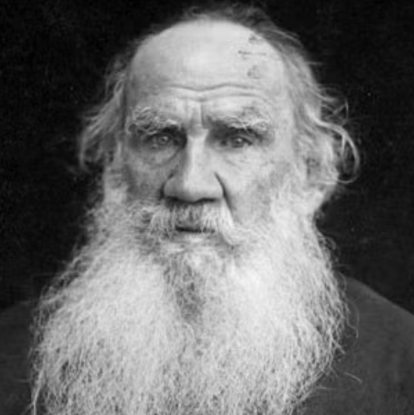

{.post-image}

# Dependence and the Anna Karenina principle

As the great novelist Leo Tolstoy wrote in his 1878 novel Anna Karenina:

> "Все счастливые семьи похожи друг на друга, каждая несчастливая семья несчастлива по-своему."

Meaning: all happy families are alike; each unhappy family is unhappy in its own way. But it sounds much better in Russian.

In probability, as in life, all happy families of independent variables are alike; each unhappy family of dependent variables is unhappy, or dependent, in its own way.

If my grandmother were to sample an absolutely random group of 20 different kids and record their shoe size (and age), we would have a happy family of independent variables, and we could have multiplied their probability densities, got our likelihood and maximized it to get our parameters.

Too fast? Let's take it slower.

If my grandmother were to sample an absolutely random group of 20 different kids and record their shoe size (and age), she could have gone with the simple global model:

$$
\text{shoe size}_{\text{kid}_j} = \text{intercept}_{\text{global}} + \text{slope}_{\text{global}} \times \text{age}_j + \text{error}_{\text{kid}_j}
$$

where $\text{intercept}_{\text{global}}$ and $\text{slope}_{\text{global}}$ are the global, fixed,  intercept and slope parameters, and $\text{error}_{\text{kid}_j}$ is the random error term coming from a $\mathcal{N}(0, \text{var}_{\text{error}})$ distribution, and each error term is independent of the other error terms. The shoe size of each kid $j$ would be a random variable that is normally distributed with a mean of $\{\text{intercept}_{\text{global}} + \text{slope}_{\text{global}} \times \text{age}_j\}$ and a variance of $\text{var}_{\text{error}}$, or:

$$\text{shoe size}_{\text{kid}_j} \sim \mathcal{N}(\text{intercept}_{\text{global}} + \text{slope}_{\text{global}} \times \text{age}_j, \text{var}_{\text{error}})$$

This actually needs proof, but we'll skip it for now. All I'm saying is that if we have a random variable $X$ (the error term) with a $\mathcal{N}(0, \text{var})$ distribution, and we add to it a constant $c$ (intercept + slope x age), then the distribution of $X + c$ is $\mathcal{N}(c, \text{var})$.

If this is intuitive to you, great. If not, great. The important thing to notice is that this distribution of kid $j$'s shoe size is **only** a function of kid $j$ --- their age which is given, and a personal random error term, which is independent of the other kids' error terms. A kid $j$'s shoe size isn't dependent of the other kids --- their shoe sizes, ages or error terms. That is why I say the kids' shoe sizes would be independent, just like the heights of random individuals from the previous [post](../08_likelihood.qmd), a happy family.

The likelihood would be the product of the probability densities of each kid's shoe size:

$$
\begin{align}
Likelihood &= f(\text{the data we observed}) \\
&= f(\text{Kid 1's shoe size is 25.4}, \text{Kid 2's shoe size is 19.9}, \dots) \\
&= f(\text{shoe size}_1 = 25.4, \text{shoe size}_2 = 19.9, \dots, \text{shoe size}_{20} = 33.2) \\
&= f(\text{shoe size}_1 = 25.4) \times f(\text{shoe size}_2 = 19.9) \times \cdots \times f(\text{shoe size}_{20} = 33.2)
\end{align}
$$

And each of those $f(\text{shoe size}_j = S)$ is a normal probability density term --- a daunting yet simple formula --- a function of the kid's age which is given, the global intercept and slope, and the variance of the error term --- three unknown parameters. So we would maximize the likelihood to get the best values for these three parameters, which amounts to a simple formula in this case. Independence is easy.

Dependence is hard.

How would a dependent model look like?

Suppose the 20 different kids were sampled in sequence: $\{\text{Kid}_{(1)}, \text{Kid}_{(2)}, \dots, \text{Kid}_{(20)}\}$. The first kid's shoe size was indeed random:

$$
\text{shoe size}_{\text{kid}_{(1)}} = \text{intercept}_{\text{global}} + \text{slope}_{\text{global}} \times \text{age}_{(1)} + \text{error}_{\text{kid}_{(1)}}
$$

But unbeknownst to my grandmother, some hidden mechanism was at play, and the shoe size of each kid starting with the second kid ($j=2$) was dependent on the shoe size of the previous kid ($j-1$), like so:

$$
\text{shoe size}_{\text{kid}_{(j)}} = \text{intercept}_{\text{global}} + \text{slope}_{\text{global}} \times \text{age}_{(j)} + \text{error}_{\text{kid}_{(j)}} + 0.1 \times \text{shoe size}_{\text{kid}_{(j - 1)}}
$$

That, is a dependent model.

The distribution of each kid's shoe size --- a.k.a. the *marginal* distribution --- is still a normal distribution^[Again, this needs proof, but we'll skip it for now.]. We can still write:

$$
\begin{align}
Likelihood &= f(\text{the data we observed}) \\
&= f(\text{Kid 1's shoe size is 25.4}, \text{Kid 2's shoe size is 19.9}, \dots) \\
&= f(\text{shoe size}_1 = 25.4, \text{shoe size}_2 = 19.9, \dots, \text{shoe size}_{20} = 33.2) 
\end{align}
$$

But now, we cannot simply factorize the likelihood into the product of the probability densities of each kid's shoe size. Why? Because the shoe size of each kid is dependent on the shoe size of the previous kid. So we need to take into account the dependency structure of the data.^[In this specific case, we *can* actually factorize the likelihood into a product of *conditional* probability densities, but that's a story for another time.]

That's just one unhappy family. The Anna Karenina principle tells us that there are many more.

Why invent? We have our own unhappy family!